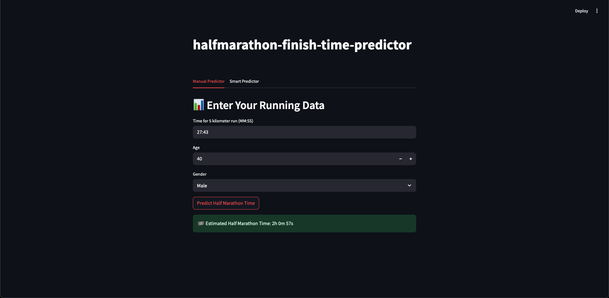
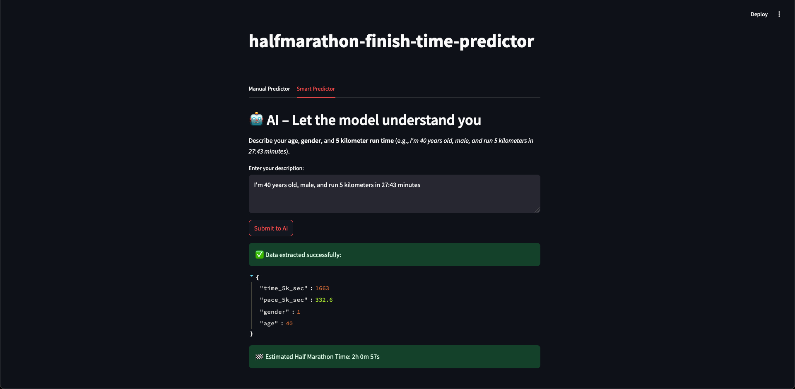

# <samp>🏃 Half Marathon Finish Time Predictor</samp>

## 📋 About the Project

Half Marathon Finish Time Predictor is an application that allows predicting half marathon finish times based on selected runner parameters. The application uses a regression model trained on real running data from the Wrocław half marathon 2023 and 2024 (approximately 18,400 records).

The project encompasses the complete Data Science process - from data acquisition and analysis, through transformation, to model training and deployment in a Streamlit-based web application.

## 🚀 Demo

The application has two intuitive interfaces:

1. **Manual Predictor** - a traditional form with fields to input 5km time, age, and gender



2. **Smart Predictor** - an advanced interface using AI to extract data from text



## ⚙️ Technologies

- **Frontend/Backend**: Python, Streamlit
- **Data Analysis**: Pandas, NumPy, Seaborn, Matplotlib, Plotly
- **Machine Learning**: PyCaret, scikit-learn (train_test_split, cross-validation)
- **AI Integration**: OpenAI (GPT-4o), Instructor, Pydantic
- **Data Management**: Boto3 (DigitalOcean Spaces), IO
- **Data Validation**: Pandera
- **Monitoring**: Langfuse
- **Other Tools**: Python-dotenv, Pathlib, YData Profiling

## 🔧 Installation and Execution

```bash
# Clone repository
git clone https://github.com/zeglicz/halfmarathon-finish-time-predictor.git
cd halfmarathon-finish-time-predictor

# Install dependencies
pip install -r requirements.txt

# Configure environment variables
cp .env.example .env
# Edit the .env file and add your API keys

# Run the application
streamlit run app.py
```

## 🧠 Approach and Technical Solutions

The project implements a comprehensive approach to creating a machine learning application:

1. **Data Acquisition** - data is retrieved from Digital Ocean Spaces using Boto3, allowing for cloud-based data work without local file storage.

2. **Exploratory Data Analysis (EDA)** - data analysis using visualization libraries (Seaborn, Matplotlib, Plotly) and automatic profiling (YData Profiling).

3. **Data Processing** - data transformation pipeline with feature engineering techniques and schema validation (Pandera).

4. **Modeling** - using PyCaret to train and optimize a regression model for predicting half marathon finish times.

5. **AI Integration** - application of the GPT-4o model to extract structured data from natural text using Instructor and Pydantic.

6. **Monitoring** - tracking AI performance and queries using Langfuse.

7. **Front-end** - intuitive user interface built with Streamlit with a clear division into manual and smart modes, providing access to functionality without requiring knowledge of code.
